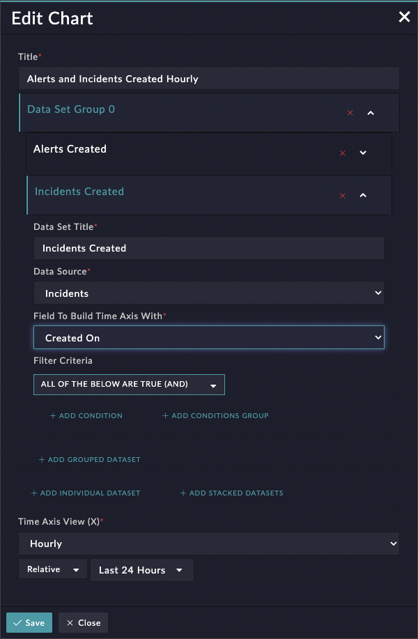
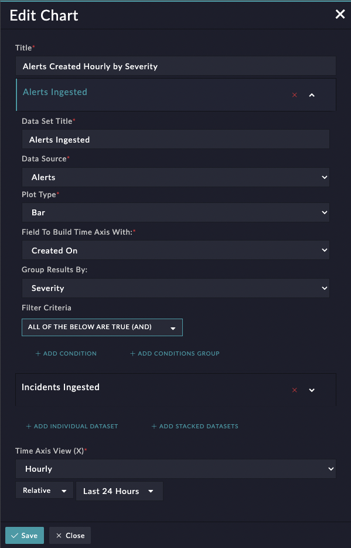

| [Home](../README.md) |
|----------------------|

# Usage

## Data Set Grouping

The Time Series Chart Widget provides two ways to show Data Sets as grouped: Data Set Groups, and Field-Based Grouping.

**Data Set Groups**
When a Data Set Group is configured, multiple Data Sets can be configured within the group. These Data Sets will be queried separately, but rendered in the chart as a stacked bar, with each Data Set's result appearing as a different color on the stack

**Field-Based Grouping**
Individual Data Sets (those not created as part of a Data Set Group) can also be marked for grouping based on a picklist field in the Data Set's chosen module. When this option is selected, the Data Set will be queried as normal, but the results will be separated by each value in the chosen picklist. For example if a Data Set on the Alerts module is separated based on the Severity field, then a separate bar, line, spline, etc would be created for the Low, Medium, and High quantities on the chart.

| [Installation](./docs/setup.md#installation) | [Configuration](./docs/setup.md#configuration) | [Contents](./docs/contents.md) |
|----------------------------------------------|------------------------------------------------|--------------------------------|